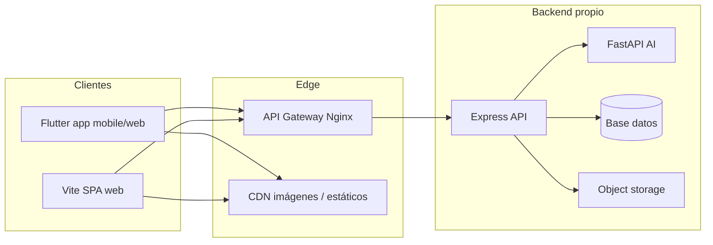

# 02 — Arquitectura y repositorio

## 2.1 Decisión de arquitectura (monolito vs microservicios)

Se adopta una arquitectura de **microservicios pragmática**:

- `gateway` (Nginx) como entrada única.
- `api` (Node.js + Express) para negocio y exposición REST.
- `ai` (FastAPI) para capacidades de inteligencia artificial.

No se usa monolito puro porque:

- IA y API escalan de forma distinta.
- Permite despliegue independiente del stack de IA.
- Reduce impacto de fallos al aislar dominios.

## 2.2 Vista lógica (C4 — nivel contenedor)



- El gateway publica solo `/v1/*` y `/health`.
- `api` y `ai` quedan en red interna de contenedores.
- Los clientes no consumen `ai` directamente.

## 2.3 Estructura del monorepo

```
aplication-ai-maquillaje/
├── backend/
│   ├── gateway/              # Nginx API Gateway
│   ├── api/                  # Node + Express + Prisma
│   └── ai-service/           # FastAPI IA
├── mobile/                   # Proyecto Flutter (Android, iOS, Web)
├── src/                      # SPA Vite (TypeScript)
└── docs/                     # Esta documentación
```

| Directorio | Contrato de dependencias |
|------------|---------------------------|
| `backend/gateway` | Reverse proxy, rate limiting y routing norte-sur. |
| `backend/api` | API pública, auth JWT y orquestación hacia IA. |
| `backend/ai-service` | Recomendaciones/try-on por token interno. |
| `mobile/pubspec.yaml` | Cliente Flutter y plugins. |
| `package.json` (raíz) | Toolchain Vite/TypeScript del panel web. |

## 2.4 Comunicación entre servicios

### Norte-Sur (cliente a backend)

1. Cliente llama `http(s)://<dominio>/v1/...`
2. Gateway aplica límites de tráfico y cabeceras de seguridad.
3. Gateway reenvía al servicio `api`.

### Este-Oeste (backend interno)

1. `api` recibe petición (por ejemplo, recomendaciones o try-on).
2. `api` llama a `ai` por `AI_SERVICE_URL=http://ai:8000`.
3. `ai` valida `X-Internal-Token`.
4. `api` normaliza y devuelve respuesta al cliente.

## 2.5 Riesgos y decisiones

- **Dos superficies web:** Vite y Flutter Web pueden divergir; definir owner por feature.
- **IA interna sin autoscaling aún:** planificar HPA/KEDA al mover a Kubernetes.
- **SQLite en etapa actual:** migrar a PostgreSQL antes de producción de alto tráfico.
